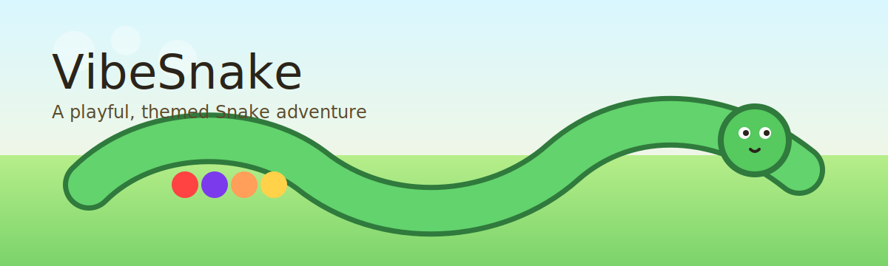

# VibeSnake

Classic Snake with themed environments, bonus items, and hazards.

## Features
- Three randomized themes: meadow, jungle, desert
- Multiple fruit types per theme
- Bonus items (temporary) worth extra points
- Hazards (temporary) that cause game over
- Keyboard and on-screen controls

## Controls
- Move: arrow keys or WASD
- Pause: Space
- Restart: Enter

## Run Locally
Open `index.html` in a browser.

Optional local server:

```bash
python3 -m http.server
```

Then visit `http://localhost:8000/index.html`.

## GitHub Pages
A Pages workflow is included. After the first push, enable Pages in the repo settings if needed:
- Settings → Pages → Build and deployment → Source: GitHub Actions

Your site will be available at:
`https://deggie.tech/`

## Global Leaderboard (Cloudflare Workers + KV)
The game can use a global Top 10 leaderboard backed by Cloudflare Workers + KV.

### Deploy the Worker
1. Install Wrangler:
```bash
npm install -g wrangler
```
2. Login:
```bash
wrangler login
```
3. Create a KV namespace (note the IDs returned):
```bash
wrangler kv:namespace create vibesnake_scores
wrangler kv:namespace create vibesnake_scores --preview
```
4. Update `worker/wrangler.toml` with the `id` and `preview_id` values.
5. Deploy:
```bash
cd worker
wrangler deploy
```

### Notes
- The Worker serves `https://vibesnake-leaderboard.deggieq2.workers.dev/api/leaderboard`.
- Local dev: run `wrangler dev` from `worker/` and the game will use `http://localhost:8787/api/leaderboard`.
- The game falls back to local scores if the global API is unavailable.
